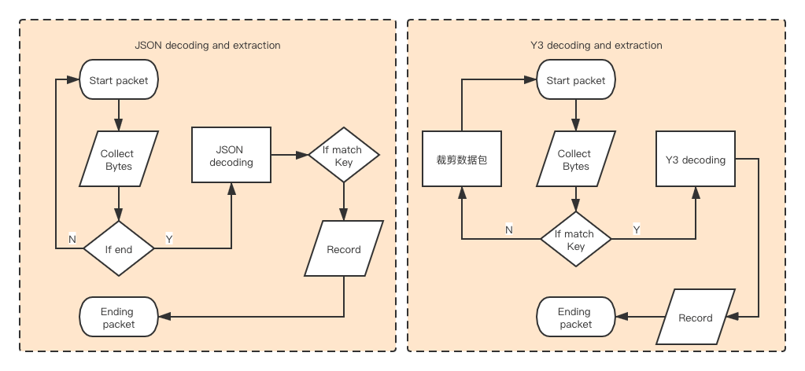

# YoMo介绍

YoMo is a low-latency streaming Serverless development framework built for edge computing, Communication based on [QUIC Transport](https://quicwg.org/) protocol,  [Functional Reactive Programming](https://en.wikipedia.org/wiki/Functional_reactive_programming)  as a programming paradigm. Simplify the complexity of building that is reliable,secure and low latency. Unlocking the Potential of 5G and the Value of Real-Time Computing.

Official website: [https://yomo.run](https://yomo.run/?utm_source=github&utm_campaign=ossc) (Thanks to <a href="https://vercel.com/?utm_source=cella&utm_campaign=oss" target="_blank">Vercel</a> support)

For english, check: [Github](https://yomo.run/)

# Y3 Introduction

[y3-codec-golang](https://github.com/yomorun/y3-codec-golang) is a [SPEC](https://github.com/yomorun/yomo-codec/blob/draft-01/SPEC.md) implementation of  [Y3 Codec](https://github.com/yomorun/y3-codec)  through the golang language; provides the ability to encode and decode `TLV structures` and basic data types, and provide [YoMo](https://github.com/yomorun/yomo)  with codec tools to support its message processing. You can extend it to handle more data types, and even extend and apply it to other frameworks that require codecs.

Project Description: [README.md](https://github.com/yomorun/yomo-codec-golang/blob/master/README_CN.md)

## Why do you need Y3?

As we all know, we often use JSON as the codec of messages in HTTP communication, then why do we still need to develop our own Y3 Codec to support YoMo applications?

- JSON has the problem that the codecs of Fully Decode in general have,  you have to read the whole file even if you only want to access a specific key-value value, which leads to the necessity to load the complete packet of data into memory before you can perform the decoding operation, while for the scenario of streaming computing, it is desired to ignore the key values that are not of concern and load only the data that are really of concern, thus improving the real-time performance and resource utilization.
- JSON decoding usually uses a lot of reflections, which makes its performance suffer, while Y3Codec decodes only the actual key-value being listened to, so the use of actual reflections is greatly reduced.
- In industrial Internet or network applications with strict requirements on computing resources, less CPU resources are required to be consumed for the same codec operations, thus allowing the limited computing resources to be more fully utilized.

This performance test is to verify that Y3 Codec has higher data decoding performance than JSON with less resource consumption, thus providing YoMo with more real-time, efficient and low-loss message processing capability.

# Test Description

## 1. Test Method

* By Benchmark, offering both serial and parallel, the latter in order to see how well the performance performs with full use of CPU resources.

* The packet being tested is generated programmatically, and the Codec is guaranteed to contain the exact same value of the key-value pair as the data used for the JSON test.

* The key-value pairs contained in the tested data are divided into 3, 16, 32 and 63 pairs. The impact on decoding performance is judged under different key-value numbers. The key being listened to is the middle value of its number: K08 indicates listening to the value of the 8th key. This results in these dimensions as follows:

  | Symbolic    | Number of Key-value         | The location of the key |
  | ----------- | --------------------------- | ----------------------- |
  | **C63-K32** | Total **63 pairs**key-value | The **32nd** key        |
  | **C32-K16** | Total **32 pairs**key-value | The **16nd** key        |
  | **C16-K08** | Total **16 pairs**key-value | The **08nd** key        |
  | **C03-K02** | Total **03 pairs**key-value | The **02nd** key        |

* The results of the test include the following: 

  * Performance comparison of operations that decode and extract the value value corresponding to the key being listened to from a packet.
  * Compare their CPU usage time in the same decoding and extraction scenario.

## 2. Data Structure

* Y3 test data

  ```go
  0x80
      0x01 value
      ....
      0x3f value 
  ```

* Structure of JSON test data

  ```go
  {
      "k1": value,
      ...
      "k63" value
  }
  ```

## 3. 数据处理逻辑



## 4. Test Items

* The code for this test report is available from the [yomo-y3-stress-testing](https://github.com/10cella/yomo-y3-stress-testing) project.

* Main code structure description:

  ```
  
  ├── cpu
  │   ├── cpu_pprof.go											// Used to generate profile information for the cpu
  ├── docs
  │   ├── report_graphics.ipynb							// Generate comparison charts
  ├── internal
  │   ├── decoder
  │   │   ├── codec.go											// TakeValueFromCodec, for performing single-extraction tests
  │   │   ├── json.go												// TakeValueFromJSON, for performing single-extraction tests
  │   │   ├── report_parallel
  │   │   │   ├── report_benchmark_test.go	// Code to perform parallel testing
  │   │   │   └── report_benchmark_test.sh	// Formatting the results of parallel tests
  │   │   ├── report_serial
  │   │   │   ├── report_benchmark_test.go	// Code to perform serial testing
  │   │   │   └── report_benchmark_test.sh  // Formatting the results of serial tests
  │   ├── generator
  │   │   ├── codec_data.go									// Generate Codec's dataset
  │   │   └── json_data.go									// Generate JSON datasets
  │   ├── pprof
  │   │   └── pprof.go											// Support to get pprof information
  ```

## 5. Test Environment

- Hardware：
  - CPU：2.6 GHz 6P intel Core i7，**GOMAXPROCS=12**
  - Memory：32GB
  - Hard Disk：SSD
- Software：
  - macOS Catalina
  - go version go1.14.1 darwin/amd64
  - [yomo-y3-stress-testing](https://github.com/10cella/yomo-y3-stress-testing)

# Benchmark test

## 1. Serial test process

* Test Code：`./internal/decoder/report_serial/report_benchmark_test.go`，如：

  ```go 
  // For Y3Codec
  func Benchmark_Codec_C63_K32(b *testing.B) {
  	var key byte = 0x20
  	data := generator.NewCodecTestData().GenDataBy(63)
  	b.ResetTimer()
  	for i := 0; i < b.N; i++ {
  		if decoder.TakeValueFromCodec(key, data) == nil {
  			panic(errors.New("take is failure"))
  		}
  	}
  }
  
  // For JSON
  func Benchmark_Json_C63_K32(b *testing.B) {
  	key := "k32"
  	data := generator.NewJsonTestData().GenDataBy(63)
  	data = append(data, decoder.TokenEnd)
  	b.ResetTimer()
  	for i := 0; i < b.N; i++ {
  		if decoder.TakeValueFromJson(key, data) == nil {
  			panic(errors.New("take is failure"))
  		}
  	}
  }
  ```

  * Benchmark_Codec_C63_K32：extracts the value of the 32nd key from a dataset with 63 key-value groups
  * Default：GOMAXPROCS=12

* Start test script:  `./internal/decoder/report_serial/report_benchmark_test.sh` 

  ```bash 
  temp_file="../../../docs/temp.out"
  report_file="../../../docs/report.out"
  go test -bench=. -benchtime=3s -benchmem -run=none | grep Benchmark > ${temp_file} \
    && echo 'finished bench' \
    && cat ${temp_file} \
    && cat ${temp_file} | awk '{print $1,$3}' | awk -F "_" '{print $2,$3"-"substr($4,1,3),substr($4,7)}' | awk -v OFS=, '{print $1,$2,$3}' > ${report_file} \
    && echo 'finished analyse' \
    && cat ${report_file}
  ```

  Generate a test result set and save it to:`./docs/report.out`。

* Generate results charts：`./docs/report_graphics.ipynb`

  ```bash
  python --version # Python version > 3.2.x
  pip install runipy
  bar_ylim=70000 barh_xlim=20 runipy ./report_graphics.ipynb
  ```

## 2. Parallel testing process

* Test Code：`./internal/decoder/report_parallel/report_benchmark_test.go`，如：

  ```go
  func Benchmark_Codec_C63_K32(b *testing.B) {
  	var key byte = 0x20
  	data := generator.NewCodecTestData().GenDataBy(63)
  	b.ResetTimer()
  	b.RunParallel(func(pb *testing.PB) {
  		for pb.Next(){
  			if decoder.TakeValueFromCodec(key, data) == nil {
  				panic(errors.New("take is failure"))
  			}
  		}
  	})
  }
  ```

* Start test script： `./internal/decoder/report_parallel/report_benchmark_test.sh` 

  Generate a test result set and save it to: `./docs/report.out`。

* Generate results charts：

  ```bash
  bar_ylim=18000 barh_xlim=25 runipy ./report_graphics.ipynb
  ```

## 3. Test results

* Serial test results：

  - Comparison of time consumption：Chart 3.1

  

  - Rate of growth：Chart 3.2

    

  * Chart Description：
    * X coordinate of Chart 3.1：C63-K32，indicates that the packet contains 63 key-value pairs，Listen to the same 32nd bit of the key to extract its value。
    * Y coordinate of Chart 3.1：Indicates the number of nanoseconds taken for a single operation.
    * X coordinate of Chart 3.2：Growth times (JSON decoding time / Y3 decoding time), 43010/2077=20.07

* Parallel test results：

  * Comparison of time consumption：Chart 3.3

    

  * Rate of growth：Chart 3.4

    

## 4. Test Analysis

* The decoding performance of Y3 is much better than JSON, and the more key-value pairs are included in the packet, the more significant the performance improvement is, with an average increase of 10 times.
  *(20.7+15.8+6.2+3.3)/4=11.5*
  
* Parallel decoding using multiple cores has a big performance boost. Parallel vs. serial has a 3x performance improvement: 
  
  |               | C63-K32 | C32-K16 | C16-K08 | C03-K02 |
  | ------------- | ------- | ------- | ------- | ------- |
  | Serial test   | 2077    | 1361    | 1667    | 610     |
  | Parallel test | 706     | 505     | 515     | 175     |
  | Growth        | 290%    | 260%    | 320%    | 350%    |

# CPU resource analysis

## 1. Testing process

* Test Code： `./cpu/cpu_pprof.go`

  ```go 
  func main() {
  	dataCodec := generator.NewCodecTestData().GenDataBy(63)
  	dataJson := generator.NewJsonTestData().GenDataBy(63)
  	dataJson = append(dataJson, decoder.TokenEnd)
  
  	// pprof
  	fmt.Printf("start pprof\n")
  	go pprof.Run()
  	time.Sleep(5 * time.Second)
  
  	fmt.Printf("start testing...\n")
  	for {
  		if decoder.TakeValueFromCodec(0x20, dataCodec) == nil {
  			panic(errors.New("take is failure"))
  		}
  		if decoder.TakeValueFromJson("k32", dataJson) == nil {
  			panic(errors.New("take is failure"))
  		}
  	}
  }
  ```

* Observe the CPU resource share by looking at the sampling graph of the cpu profile
  
* Run test：

  ```bash
  # pprof starts port 6060 by default
  go run ./cpu_pprof.go
  # analysis diagram through port 8081
  go tool pprof -http=":8081" http://localhost:6060/debug/cpu/profile
  ```

## 2.Test results


## 3.Test Analysis

The decoding of Y3 takes up far less CPU resources than JSON, and the difference is more than 10 times (*0.73/0.07=10.4*). Low CPU resource consumption, while decoding speed has been greatly improved.


# Test Conclusion

The decoding performance of Y3 and JSON is greatly improved, and the more the number of keys in the packet, the more the performance is improved, and the CPU resource consumption of Y3 is also greatly reduced. This performance test verifies that Y3's decoding capability can provide YoMo with real-time, efficient and low-loss message processing capability.